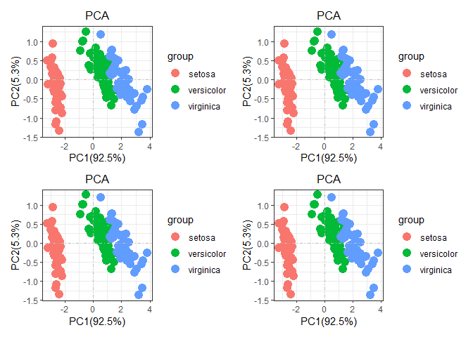
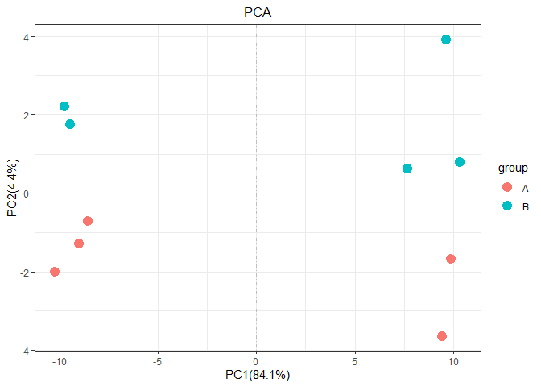

<!-- README.md is generated from README.Rmd. Please edit that file -->

# autopca

<!-- badges: start -->

[](https://GitHub.com/Naereen/StrapDown.js/watchers/)[](https://github.com/Naereen?tab=followers)[](https://GitHub.com/Naereen/StrapDown.js/releases/)[](https://GitHub.com/Naereen/StrapDown.js/releases/)
<!-- badges: end -->

Originally,this R package `autopca` was a script I used to draw PCA. PCA
can analyze batch effects in experimental processing, and also analyze
experimental processing factors. In my point, it is very important in
checking omics data. At present, this R package Features are very few
But are under active development. The basic function is already there,
so I placed on `github`, if necessary, you can download and use it
yourself.

## Installation

The R packages only can install the development version from
[GitHub](https://github.com/) with:

``` r
# install.packages("devtools")
devtools::install_github("wangjiaxuan666/autopca")
```

## Example

Before we start the PCA analysis, we first need to tidy the input data.
We can use the function `pca_data_tidy`to make the data clean for the
next PCA analysis.It should be noted that the format of the input data
is very important to determine the success of subsequent analysis.

Here, Emphasize the format of the input data. First, PCA analysis use
the function `stat::prcomp`, Consequently the result given the every
observed values’ Variance in principal components. the observed values
is the `prcomp` data’ rownames. For example, the data iris

``` r
head(iris)
#>   Sepal.Length Sepal.Width Petal.Length Petal.Width Species
#> 1          5.1         3.5          1.4         0.2  setosa
#> 2          4.9         3.0          1.4         0.2  setosa
#> 3          4.7         3.2          1.3         0.2  setosa
#> 4          4.6         3.1          1.5         0.2  setosa
#> 5          5.0         3.6          1.4         0.2  setosa
#> 6          5.4         3.9          1.7         0.4  setosa
```

the rownames is every iris ID number, in iris, we want to demonstrate
the proportion of each iris flower in terms of petal length and width
and so on. That is we want, so for iris data, we just tidy a little for
next analysis. Just like

``` r
library(autopca)
irisgroup <- iris[,5] 
iristidy <- iris[,-5]
pca(iristidy,sample_group = as.data.frame(irisgroup))
#> ...Notice: the sequence of sample names
#> ...must be matched for the input data rownames
#> ...If not,the result probably is wrong
```

 the
group information is Grouping information is required, otherwise an
error will be reported\!

``` r
#pca(iris)
```

As for why and how to use `autopca`, We need to start from the
beginning.

## Illustration

the `autopca` designed for transcriptome data, The classic transcriptome
data is rownames is gene id, the column names is every observed sample.
sometime it also add some annotation information in the tail. like this.

``` r
test = matrix(rnorm(200), 20, 10)
test[1:10, seq(1, 10, 2)] = test[1:10, seq(1, 10, 2)] + 3
test[11:20, seq(2, 10, 2)] = test[11:20, seq(2, 10, 2)] + 2
test[15:20, seq(2, 10, 2)] = test[15:20, seq(2, 10, 2)] + 4
colnames(test) = paste("Test", 1:10, sep = "")
rownames(test) = paste("Gene", 1:20, sep = "")
annot <- c(rep("KEGG",20))
test <- data.frame(test,annot)
head(test)
#>          Test1      Test2    Test3      Test4    Test5
#> Gene1 1.765032 -0.3577624 2.477608 -0.4832594 2.964369
#> Gene2 2.814791 -0.8978281 2.287567  0.3145828 2.777988
#> Gene3 2.757540 -0.2149529 4.514153  0.8454416 2.844257
#> Gene4 2.926179 -0.1924484 1.795893  1.1451809 3.975598
#> Gene5 1.797332  1.5983340 2.719382 -1.7759772 4.771807
#> Gene6 4.526338 -0.0930217 3.482939 -1.4561555 2.307828
#>             Test6    Test7      Test8    Test9     Test10 annot
#> Gene1 -1.13248990 3.035722  1.1860571 2.936626  0.5698577  KEGG
#> Gene2 -0.48468162 1.719169 -1.2244367 3.123951  1.2850013  KEGG
#> Gene3  0.32157962 3.638809 -0.8146574 1.073289 -1.2964544  KEGG
#> Gene4 -0.52685583 3.005546  1.2763350 1.466215 -1.4490338  KEGG
#> Gene5 -0.37975269 2.188645  0.4032756 3.984414  0.4298045  KEGG
#> Gene6 -0.01896003 2.572865 -0.7257124 2.830020 -0.4696124  KEGG
```

Through the above steps, we obtained a classic transcriptome data frame.
**NOW WE explain the sample variance in PC. So we need tidy the data by
the function`pca_data_tidy`.**

``` r
pca_data_tidy(as.data.frame(test)) -> test_tidy
#> ... Notice: the input data is a data frame not a tibble
#> ... Problem: the input data vaule in every column must be numberic value
#> ... Problem: the error because the character type value in data
#> ... Successed! the pca data save in the object
```

NEXT, we can use the tidy data to analysis, just like this

``` r
as.data.frame(c(rep("A",5),rep("B",5))) -> group
rownames(group) <- colnames(test[,-11])
colnames(group) <- "group"
head(group)
#>       group
#> Test1     A
#> Test2     A
#> Test3     A
#> Test4     A
#> Test5     A
#> Test6     B
pca(test_tidy,sample_group = group)
#> ...Notice: the sequence of sample names
#> ...must be matched for the input data rownames
#> ...If not,the result probably is wrong
```



Of course, as a fan of `tidyverse`, all function in `autopca` also
support `tibble` data input. If there are any questions and suggestions
in use, welcome questions and suggestions
