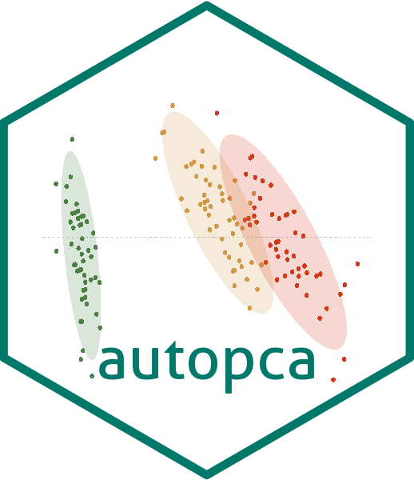
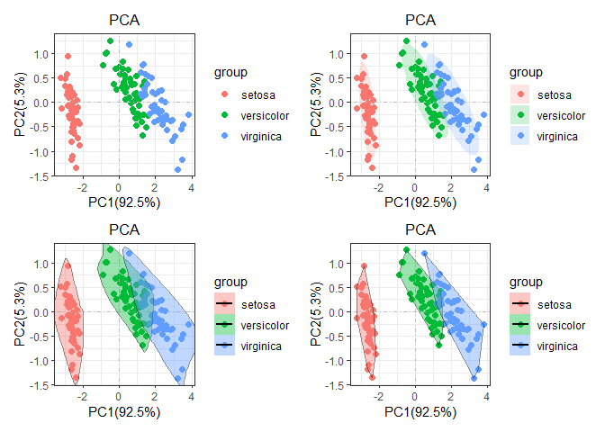
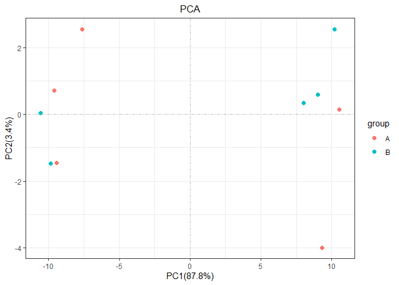

<!-- README.md is generated from README.Rmd. Please edit that file -->
<!-- badges: start -->

[](https://img.shields.io/github/issues/wangjiaxuan666/autopca)
[](https://img.shields.io/github/forks/wangjiaxuan666/autopca)
[](https://img.shields.io/github/stars/wangjiaxuan666/autopca)
<!-- badges: end -->

# autopca:wrench: 

**Author**: [Jiaxuan Wang](https://abego.cn/) :pencil:

[](https://pic-1259340288.cos.ap-guangzhou.myqcloud.com/back/qrcode_for_Wechat.jpg)

Originally,this R package `autopca` was a script I used to draw PCA. PCA
can analyze batch effects in experimental processing, and also analyze
experimental processing factors. In my point, it is very important in
checking omics data. At present, this R package Features are very few
But are under active development. The basic function is already there,
so I placed on `github`, if necessary, you can download and use it
yourself.

## Update

``` r
install.packages("devtools")
devtools::install_github("wangjiaxuan666/autopca")
```

## Installation

The R packages only can install the development version from
[GitHub](https://github.com/) with:

Notice : if you install `autopca` failed , please check the R installed
envirment. maybe you need install `tidyverse` or `plyr` before. IF YOU
FAILED WITH ANGRY AND BOOM ERRORS. Please contact me with
<poormouse@126.com> , I’ m sorry about what happen to you. Although it’s
me, I also have to admit that this is a bug-filled R package.

> Every time I use this R packages , it will spend 95% time to fix new
> bug! Although it will spend a little time if i use the scicpt not R
> packages. Automation is always very difficult because it is suitable
> for all kinds of situations and data type. BUT IT IS A FUN WHEN A
> PROBLEM NEED TO THINK

## Example

Before we start the PCA analysis, we first need to tidy the input data.
We can use the function `pca_data_tidy`to make the data clean for the
next PCA analysis.It should be noted that the format of the input data
is very important to determine the success of subsequent analysis.

Here, Emphasize the format of the input data. First, PCA analysis use
the function `stat::prcomp`, Consequently the result given the every
observed values’ Variance in principal components. the observed values
is the `prcomp` data’ rownames. For example, the data iris

``` r
head(iris)
#>   Sepal.Length Sepal.Width Petal.Length Petal.Width Species
#> 1          5.1         3.5          1.4         0.2  setosa
#> 2          4.9         3.0          1.4         0.2  setosa
#> 3          4.7         3.2          1.3         0.2  setosa
#> 4          4.6         3.1          1.5         0.2  setosa
#> 5          5.0         3.6          1.4         0.2  setosa
#> 6          5.4         3.9          1.7         0.4  setosa
```

the rownames is every iris ID number, in iris, we want to demonstrate
the proportion of each iris flower in terms of petal length and width
and so on. That is we want, so for iris data, we just tidy a little for
next analysis. Just like

``` r
library(autopca)
library(patchwork)
irisgroup <- iris[,5] 
iristidy <- iris[,-5]
p1 = pca(iris[,-5],sample_group = as.data.frame(iris[,5]))
p2 = pca(iris[,-5],sample_group = as.data.frame(iris[,5]),add_ploy =  "ellipse")
p3 =pca(iris[,-5],sample_group = as.data.frame(iris[,5]),add_ploy = "encircle")
p4 = pca(iris[,-5],sample_group = as.data.frame(iris[,5]),add_ploy = "polygon")
p1+p2+p3+p4
```

 the
group information is Grouping information is required, otherwise an
error will be reported!

``` r
#pca(iris)
```

As for why and how to use `autopca`, We need to start from the
beginning.

## Illustration

the `autopca` designed for transcriptome data, The classic transcriptome
data is rownames is gene id, the column names is every observed sample.
sometime it also add some annotation information in the tail. like this.

``` r
test = matrix(rnorm(200), 20, 10)
test[1:10, seq(1, 10, 2)] = test[1:10, seq(1, 10, 2)] + 3
test[11:20, seq(2, 10, 2)] = test[11:20, seq(2, 10, 2)] + 2
test[15:20, seq(2, 10, 2)] = test[15:20, seq(2, 10, 2)] + 4
colnames(test) = paste("Test", 1:10, sep = "")
rownames(test) = paste("Gene", 1:20, sep = "")
annot <- c(rep("KEGG",20))
test <- data.frame(test,annot)
head(test)
#>          Test1       Test2    Test3       Test4    Test5
#> Gene1 3.885105 -1.40996356 2.082833  1.74326260 2.922234
#> Gene2 3.116096 -0.79413555 3.188819 -0.40254010 3.036880
#> Gene3 2.817635 -0.98390401 2.651808 -1.87837298 2.957372
#> Gene4 2.696947 -0.05363688 3.058046  0.13078877 3.612569
#> Gene5 1.544220  0.34743798 2.642220 -0.04920413 1.315197
#> Gene6 4.434048 -0.42054450 3.187126 -2.05952773 2.736322
#>             Test6    Test7       Test8    Test9       Test10
#> Gene1  1.08305670 4.035495 -0.01374523 5.178203  0.001947392
#> Gene2  0.23804056 2.429948  1.40977634 4.485687  0.571390923
#> Gene3 -0.32113599 2.343335  0.01128968 1.884459  0.230932915
#> Gene4 -0.06159268 3.369248  0.13621463 4.633204 -0.476862998
#> Gene5 -1.08884753 3.528223 -1.01294805 2.711387  0.075084606
#> Gene6  0.09278681 2.462118 -0.40843086 2.840577 -0.116544660
#>       annot
#> Gene1  KEGG
#> Gene2  KEGG
#> Gene3  KEGG
#> Gene4  KEGG
#> Gene5  KEGG
#> Gene6  KEGG
```

Through the above steps, we obtained a classic transcriptome data frame.
**NOW WE explain the sample variance in PC. So we need tidy the data by
the function`pca_data_tidy`.**

``` r
pca_data_tidy(as.data.frame(test)) -> test_tidy
#> ... Notice: the input data is a data frame not a tibble
#> ... Problem: the input data vaule in every column must be numberic value
#> ... Problem: the error because the character type value in data
#> ... Successed! the pca data save in the object
```

NEXT, we can use the tidy data to analysis, just like this

``` r
as.data.frame(c(rep("A",5),rep("B",5))) -> group
rownames(group) <- colnames(test[,-11])
colnames(group) <- "group"
head(group)
#>       group
#> Test1     A
#> Test2     A
#> Test3     A
#> Test4     A
#> Test5     A
#> Test6     B
pca(test_tidy,sample_group = group)
```



But `pca` function not only that, It supports regular matching
characters to replace the names of sample or group. When the sample
names is “CK-1\_fokm, CK-2\_fokm,” and so on , It will be very useful.

``` r
#pca(data = re,# the data didn't exist,just a example to display the parameter
#    display_sample = TRUE,
#    rename = "replace",
#    str_sample = "_.*",
#    str_group = "-\\d$",
#    add_ploy = TRUE)
```

ALL parameters explain :

**Usage**:

    pca(
      data = data,
      center = T,
      retx = T,
      scale = FALSE,
      display_sample = FALSE,
      rename = c("diy", "replace"),
      sample_group = NULL,
      str_sample = NULL,
      str_group = "-.*",
      add_ploy = FALSE
    )

**Arguments**

    data:iput data form the function 'pca_data_tidy'

    center:the prcomp param, detail see '?prcomp'

    retx:the prcomp param, detail see '?prcomp'

    scale:the prcomp param, detail see '?prcomp'

    display_sample:if TRUE will add the text labels on points.

    rename：the method for change the sample and group names, two argment can choose, "diy" is for the creat a data for name,"replace" is use regexp to replace or change the name

    sample_group：a data for change the sample and group name, the rownames is sample and the first column is group

    str_sample:the 'regexp' for the sample name to become the target name

    str_group:the 'regexp' for the group name to become the target name

    add_ploy:if TRUE will add the polygon on points.

Of course, as a fan of `tidyverse`, all function in `autopca` also
support `tibble` data input. If there are any questions and suggestions
in use, welcome questions and suggestions

2021-1-2
